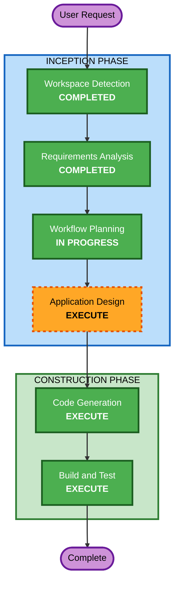

# Execution Plan

## Detailed Analysis Summary

### Change Impact Assessment
- **User-facing changes**: Yes — Full new application with polished frontend (shadcn/ui + Tailwind)
- **Structural changes**: Yes — New AWS serverless architecture (API Gateway + Lambda + DynamoDB + Cognito + S3 + CloudFront)
- **Data model changes**: Yes — 4 new DynamoDB tables (Books, Carts, Orders, OrderItems)
- **API changes**: Yes — 14 new REST API endpoints
- **NFR impact**: Yes — Frontend quality, dark mode, responsive design, accessibility (Radix UI)

### Risk Assessment
- **Risk Level**: Low — Greenfield demo application, no production dependencies
- **Rollback Complexity**: Easy — CDK destroy removes all resources
- **Testing Complexity**: Moderate — Full-stack with auth, API, and frontend

## Workflow Visualization



### Text Alternative
```
Phase 1: INCEPTION
  - Workspace Detection (COMPLETED)
  - Requirements Analysis (COMPLETED)
  - Workflow Planning (IN PROGRESS)
  - Application Design (EXECUTE)

Phase 2: CONSTRUCTION
  - Code Generation (EXECUTE)
  - Build and Test (EXECUTE)
```

## Phases to Execute

### INCEPTION PHASE
- [x] Workspace Detection (COMPLETED)
- [x] Requirements Analysis (COMPLETED)
- [ ] Reverse Engineering - SKIP
  - **Rationale**: Greenfield project, no existing code
- [ ] User Stories - SKIP
  - **Rationale**: Demo application with clear, simple scope; 3 well-defined feature areas
- [x] Workflow Planning (IN PROGRESS)
- [ ] Application Design - EXECUTE
  - **Rationale**: Need to define component structure, Lambda organization, monorepo layout, and service layer for 3 feature areas plus frontend with new UI stack (shadcn/ui)
- [ ] Units Generation - SKIP
  - **Rationale**: Single unit of work; all features are tightly coupled in one monorepo deployment

### CONSTRUCTION PHASE
- [ ] Functional Design - SKIP
  - **Rationale**: Business logic is straightforward CRUD; requirements document covers the detail needed
- [ ] NFR Requirements - SKIP
  - **Rationale**: Demo-grade NFRs already defined in requirements; no complex performance/security patterns needed
- [ ] NFR Design - SKIP
  - **Rationale**: NFR Requirements skipped
- [ ] Infrastructure Design - SKIP
  - **Rationale**: Infrastructure is standard AWS serverless pattern; will be handled directly in CDK code during Code Generation
- [ ] Code Generation - EXECUTE (ALWAYS)
  - **Rationale**: Full implementation of backend (Lambda + CDK) and frontend (React + shadcn/ui)
- [ ] Build and Test - EXECUTE (ALWAYS)
  - **Rationale**: Build verification and test instructions needed

### OPERATIONS PHASE
- [ ] Operations - PLACEHOLDER

## Execution Summary
- **Total Stages to Execute**: 3 (Application Design, Code Generation, Build and Test)
- **Total Stages Skipped**: 7 (Reverse Engineering, User Stories, Units Generation, Functional Design, NFR Requirements, NFR Design, Infrastructure Design)

## Success Criteria
- **Primary Goal**: Working AnyCompanyRead demo with polished frontend
- **Key Deliverables**:
  - AWS CDK infrastructure stack (Cognito, API Gateway, Lambda, DynamoDB, S3, CloudFront)
  - Backend Lambda functions (auth, books, cart, orders)
  - React frontend with shadcn/ui, Tailwind CSS, dark mode, responsive design
  - Seed data script for demo catalog
  - README with setup instructions
- **Quality Gates**:
  - CDK synthesizes without errors
  - Frontend builds successfully
  - All API endpoints functional
  - Frontend renders correctly with polished UI
